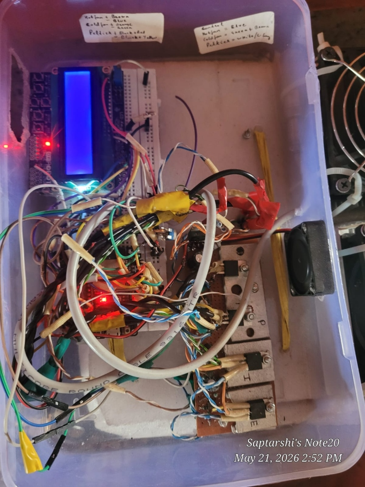
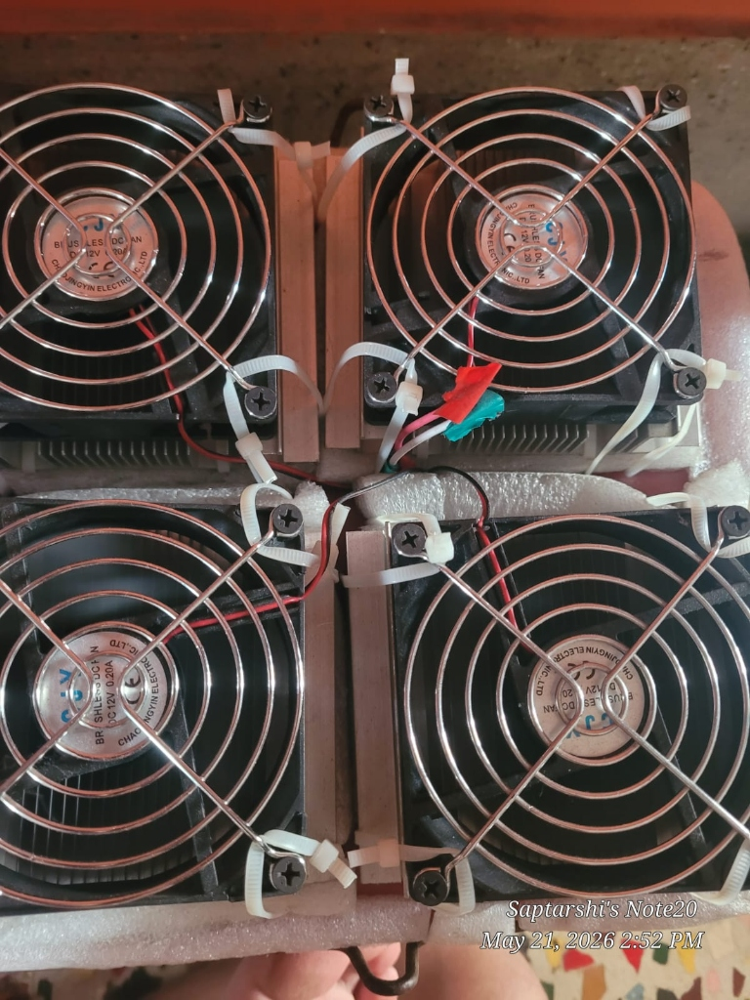

# ESP32 Smart Thermoelectric Refrigerator

A custom-built 11-liter thermoelectric cooling and environmental monitoring system using an ESP32, dual independent I2C SHT40 sensors, and PWM-switched Peltier TEC modules.


---

## Overview

The ESP32 Smart Thermoelectric Refrigerator is an embedded hardware cooling and climate monitoring system built for an 11-liter chamber. Rather than using conventional mechanical vapor-compression refrigeration, the system implements solid-state cooling via TEC1-12706 Peltier modules driven by high-current MOSFET power stages. An ESP32 microcontroller manages dual independent I2C buses to poll dual Adafruit SHT40 temperature and humidity sensors, adjusting PWM cooling levels to achieve thermal stabilization up to 13°C below ambient.

<p align="center">
  
  <br>
  <em><strong>Figure 1:</strong> Fully assembled 11-liter smart thermoelectric refrigerator prototype showing the insulated cold chamber, top-mounted quad heatsink-fan heat rejection array, and transparent electronics control unit.</em>
</p>

---


## Hardware Prototype & Subsystems

<p align="center">
  
  &nbsp;
  
  &nbsp;
  
</p>

<p align="center">
  <em><strong>Hardware Subsystems (Left to Right):</strong>
  <br>
  <strong>(1) Control & Driver Enclosure:</strong> ESP32 microcontroller, 1602 LCD diagnostics display, N-channel MOSFET switching bank on aluminium heatsinks, driver transistors, and enclosure cooling fan.
  <br>
  <strong>(2) Thermal Dissipation Stack:</strong> Quad 12V DC brushless fan array (with wire finger guards) mounted over finned aluminium heatsinks for hot-junction Peltier heat rejection.
  <br>
  <strong>(3) Insulated Cold Chamber:</strong> High-density polystyrene insulated 11-liter chamber with cold-side thermal conduction base showing active moisture condensation.
  </em>
</p>

---

## Technical Specifications

- **Microcontroller:** ESP32-WROOM-32 / LilyGO T-Display (Xtensa dual-core 32-bit LX6)
- **Cooling Mechanism:** Dual TEC1-12706 Thermoelectric Peltier modules
- **Sensors:** 2x Sensirion SHT40 precision digital temperature and humidity sensors
- **I2C Architecture:** Dual hardware I2C buses (Bus 1: SDA=GPIO 21, SCL=GPIO 22; Bus 2: SDA=GPIO 25, SCL=GPIO 26)
- **Power Stage:** PWM-controlled high-current N-channel MOSFET switching bank
- **Power Supply:** Corsair CV450 450W ATX regulated PSU (12V rail)
- **Chamber Capacity:** 11 Liters
- **Cooling Delta:** 12–13°C reduction below 38°C ambient (down to 22°C) at 300–330W power consumption

---

## Hardware Pin Mapping

| Peripheral | Signal | ESP32 GPIO | Electrical Function |
|---|---|---|---|
| **SHT40 Sensor 1** | SDA (I2C Bus 1) | **GPIO 21** | Chamber internal temp/humidity data |
| **SHT40 Sensor 1** | SCL (I2C Bus 1) | **GPIO 22** | Chamber internal temp/humidity clock |
| **SHT40 Sensor 2** | SDA (I2C Bus 2) | **GPIO 25** | Ambient heatsink temp/humidity data |
| **SHT40 Sensor 2** | SCL (I2C Bus 2) | **GPIO 26** | Ambient heatsink temp/humidity clock |
| **Power Stage** | PWM Gate Control | Configurable | High-current MOSFET drive |
| **System Ground** | Common Return | GND | Shared return for 12V and 3.3V rails |

---

## Setup and Usage

### Prerequisites
- Install [PlatformIO Core](https://platformio.org/install/cli) or PlatformIO IDE in VS Code.
- Connect the ESP32 board via micro-USB.

### Build and Upload
```bash
# Clone the repository
git clone https://github.com/saptarshidas578/refrigarator.git
cd refrigarator

# Build firmware
pio run

# Flash to ESP32
pio run -t upload

# Monitor serial debug output (115200 baud)
pio run -t monitor -b 115200
```

---

## Author & Contact

- **Author:** [saptarshi2007 (saptarshidas578)](https://github.com/saptarshidas578)
- **Institution:** B.Tech Electrical & Computer Science Engineering, VIT Vellore
- **LinkedIn:** https://www.linkedin.com/in/saptarshi-das-3255673a1/

---

## License

This project is licensed under the [MIT License](LICENSE).
[MIT License](https://opensource.org/licenses/MIT).  

