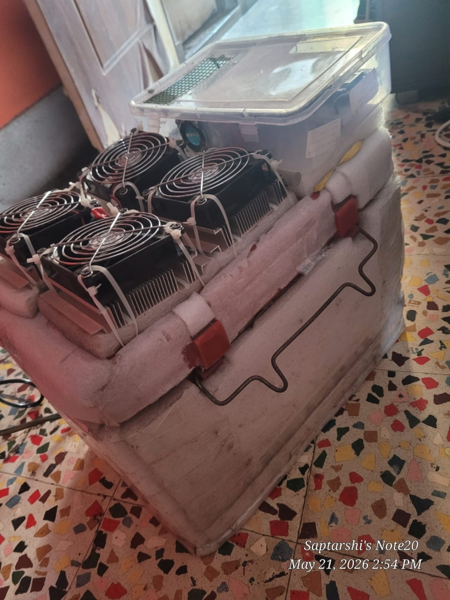
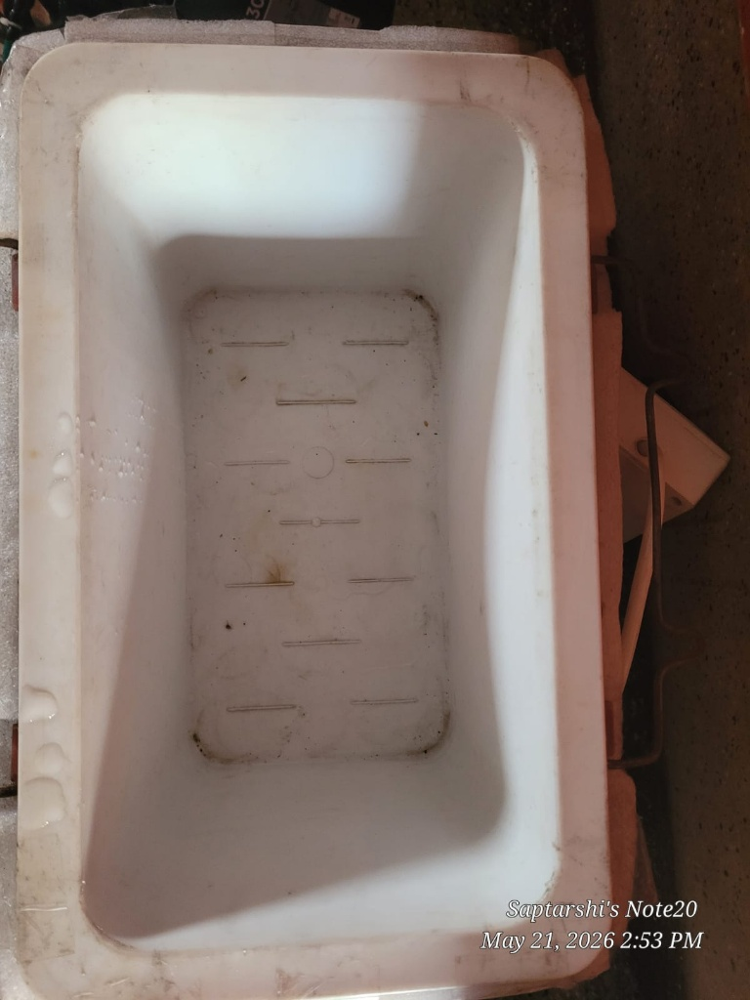

# Thermal Design & Environmental Sensing

## Peltier Cooling Architecture
- **Chamber Volume:** 11 Liters
- **Cooling Modules:** Dual TEC1-12706 Thermoelectric Cooler (Peltier) elements
- **Delta T:** 12–13°C temperature depression below ambient (38°C ambient to 22°C internal)
- **Power Rating:** 300 - 330 W total power consumption on 12V DC rail

## Dual-Bus I2C Environmental Monitoring
- **Internal Sensor (Chamber):** Adafruit SHT40 on Wire1 (SDA: GPIO 21, SCL: GPIO 22, 100 kHz)
- **External Sensor (Heatsink/Ambient):** Adafruit SHT40 on Wire2 (SDA: GPIO 25, SCL: GPIO 26, 100 kHz)

## Thermal Chamber Visuals

  
   
  <em>Figure: Complete 11-liter thermoelectric cooling assembly operating under active thermal delta testing.</em>

  
   
  <em>Figure: Internal insulated cavity showing active cooling condensation during steady-state refrigeration.</em>

